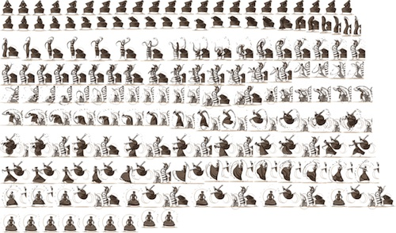

#DWM - Tips&Tricks

Grâce aux animations css et aux images sprite il est possible de créer des animations assez intéresantes.  
[Un bel exemple de notre ami google](http://www.google.com/doodles/martha-grahams-117th-birthday) créé à partir de cette image  

-------------

_From the [DWM](http://dwm.re) team - [@pixeline](https://twitter.com/pixeline) [@boblemarin](https://twitter.com/boblemarin) [@lelipelip](https://twitter.com/lelipelip) [@aqro](https://twitter.com/aqro) [@remysaintcricq](https://twitter.com/remysaintcricq) [@fbourgaux](https://twitter.com/fbourgaux) [@chdelfosse](https://twitter.com/chdelfosse) [@teddytdk](https://twitter.com/teddytdk)_
